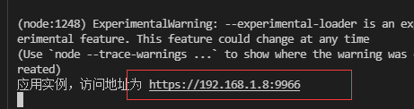
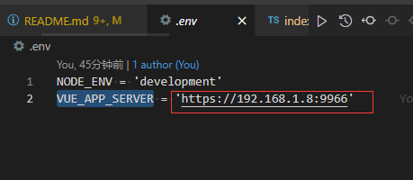
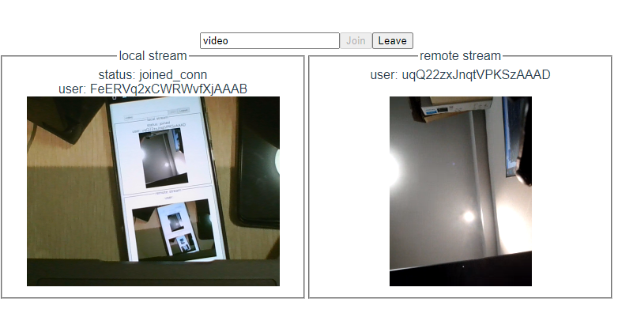

# video-talk

## 概述
基于 WebRTC 实现一对一视频通讯。
技术栈：Vue3 + TS + Express + socket.io
## 快速开始 Getting started

### 1. 拉取代码

```shell
# 拉取代码和安装依赖
git clone https://github.com/keen-wang/video-talk.git
# 进入项目目录
cd video-talk
```

### 2. 安装依赖

```shell
# 使用 node 版本 14.18.2
# nvm use v14.18.2
# 安装依赖
npm install
```
### 3. 运行信令 Web 服务器
执行下面脚本运行信令服务器
```shell
npm run server
```
运行完命令得到 https 服务的 ipv4 地址


### 4. 运行前端页面

1. 设置信令服务地址    
在 `.env` 文件中将 `VUE_APP_SERVER` 的值修改为前面运行的信令服务地址。如下图所示：


2. 运行 devServer 页面    
    运行命令完成后打开链接进行访问页面。
    ```shell
    npm run dev
    ```

### 5. 进行视频通话

使用两台在信令服务同一局域网的设备打开页面，点击 Join 按钮加入房间通话。加入房间前可以通过输入框修改要加入的房间号。



